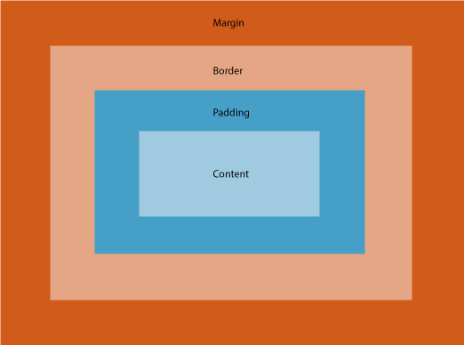
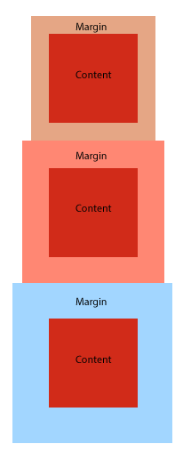
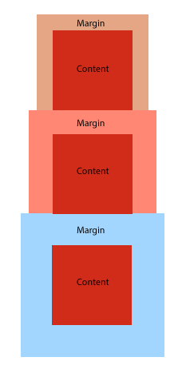

# Box Model - Margin, Border, Padding

All web layouts are accomplished with block elements. Designers use blocks, most often `<div>` elements, to create rectangular areas into which all content fits. There are only three rules:

* **Total area**: the space an element occupies _and_ affects.
* **Float, clear and overflow**
* **Nested elements**

## **Total Area**

Total width is how much horizontal space a block occupies. This includes the block's margin, border, and padding. Calculating width, padding, and margin is often the biggest headache for designers, but it's easy to see how they work if you use the **box model**.

The box model consists of the properties **margin, border,** and **padding**.



Margin is **outside** block elements, while padding is **within** them. This means that we use margin to separate a block from things around it, and padding to move a block's content away from its edges.

We can specifically set the margin, padding, or border of any side of an element.

``` css
div{
  padding-top: 10px;
  padding-right: 10px;
  padding-bottom: 10px;
  padding-left: 10px;
}
```

You can also use the shorthand property:

``` css
div{
  padding-top: 25px;
  padding-right: 50px;
  padding-bottom: 75px;
  padding-left: 100px;
}
```

is equivalent to:

``` css
div{
  padding: 25px 50px 75px 100px;
}
```

And

``` css
div{
  padding-top: 25px;
  padding-right: 50px;
  padding-bottom: 75px;
  padding-left: 50px;
}
```

is equivalent to:

``` css
div{
  padding: 25px 50px 75px;
}
```

And

``` css
div{
  padding-top: 25px;
  padding-right: 50px;
  padding-bottom: 25px;
  padding-left: 50px;
}
```

is equivalent to:

``` css
div{
  padding: 25px 50px;
}
```

And

``` css
div{
  padding-top: 25px;
  padding-right: 25px;
  padding-bottom: 25px;
  padding-left: 25px;
}
```

is equivalent to:

``` css
div{
  padding: 25px;
}
```

(The order flows clockwise, top -> right -> bottom -> left.)

Now, according to the box model, **the total width of an element is:**

> **(Margin x 2) + (Border x 2) + (Padding x 2) + Content Width**

Calculating the height is trickier. Why? Because **vertical margins collapse**.

Ex:

HTML:

``` html
<div id="box-1">
</div>
<div id="box-2">
</div>
<div id="box-3">
</div>
```

CSS:

``` css
#box-1, #box-2, #box-3{
  height: 100px;
  width: 100px;
  background-color: red;
}
#box-1{
  margin: 20px;
}
#box-2{
  margin: 30px;
}
#box-3{
  margin: 40px;
}
```

You might think that this will look like this:


But this code will actually result in this:


When the vertical margins of two elements are touching, **only the margin of the element with the largest margin value will be honored**, while the margin of the element with the smaller margin value will be collapsed to zero.

There are other situations where elements do not have their margins collapsed:

* floated elements
* absolutely positioned elements
* inline-block elements
* elements with overflow property set to anything other than visible (They do not collapse margins with their children.)
* cleared elements (They do not collapse their top margins with their parent block's bottom margin.)

NEXT: [Activity: Portfolio Webpage](./portfolio_activity.md)
