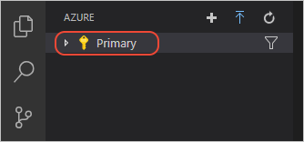
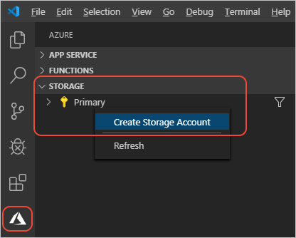
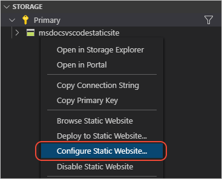

# Pubishing (deploying) your static files to Azure Storage using Visual Studio Code

In web development, "deployment" means to put the content you have created online. When you deploy you are publishing your website to the WWW. There are a number of ways to publish your content online. We will be using Azure Storage to do this with the help of Visual Studio Code.

A static website is composed of HTML, CSS, JavaScript, and other static files such as images or fonts. However you design the app, you host and serve these files directly from storage rather than using a web server. Hosting in storage is simpler and less expensive than maintaining a web server.

## Prerequisites

* An Azure subscription.
* [Visual Studio Code.](https://code.visualstudio.com/)
* [The Azure Storage extension.](https://marketplace.visualstudio.com/items?itemName=ms-azuretools.vscode-azurestorage)

## Azure subscription

If you don't have an Azure subscription, [sign up now for a free account](https://azure.microsoft.com/en-us/free/) with $200 in Azure credits to try out any combination of services.

## Sign in to Azure

Once you've installed the Azure extension, sign into your Azure account by navigating to the Azure explorer, select Sign in to Azure, and follow the prompts. (If you have multiple Azure extensions installed, select the one for the area in which you're working, such as App Service, Functions, etc.)

After signing in, verify that the email address of your Azure account (or "Signed In") appears in the Status Bar and your subscription(s) appears in the Azure explorer:

Now you have a location where you can publish all of your online work.

* Navigate to the folder you want to publish online with the command line and type:
`code .` while you are in that same directory.

* In VS Code, select the Azure logo to open the Azure explorer. Under Azure Storage, right-click on your Azure subscription and choose Create Storage Account:

* At the prompt, "Enter the name of the new storage account", enter a globally unique name for your Storage Account and press Enter. Valid characters for an app name are 'a-z' and '0-9'.

* At the prompt, "Select a resource group", select Create a new Resource Group and accept the default name.

* At the prompt, "Select a location", choose region near you.

* While the Storage account is created, progress appears in Output panel of VS Code:

* Once the Storage account is complete, right-click that account and select Configure Static Website. Enabling static website hosting means that Azure Storage automatically serves your index document and any other static assets.

* When prompted, enter index.html for both the index document name and the 404 error document name. We use index.html for our error page unless we have created a custom 404 page.

* Select the Files explorer, right-click on the folder that has your web files in it and choose **Deploy to Static Website**:

* When prompted, choose the Storage account that you created previously.

* When deployment is complete, a message appears with a Browse to website button. Select that button to open the primary endpoint of the deployed app code.

Navigate to the web address that the extension creates and you're all set! You just published your website.

## Congratulations! You have completed the workshop

## Course modules

* [Part 1. HTML: Programming the Web](Part%201.%20HTML)
* [Part 2. CSS: Selectors, Styling, and Display](Part%202.%20CSS%20%26%20CSS3)
* [Part 3. Javascript](Part%203.%20Javascript)
* [Part 4. JQuery + APIs](Part%204.%20JQuery%20%2B%20APIs)
* [Part 5. Capstone + Deployment with Azure](Part%205.%20%20Capstone%20%2B%20Web%20Publishing)
