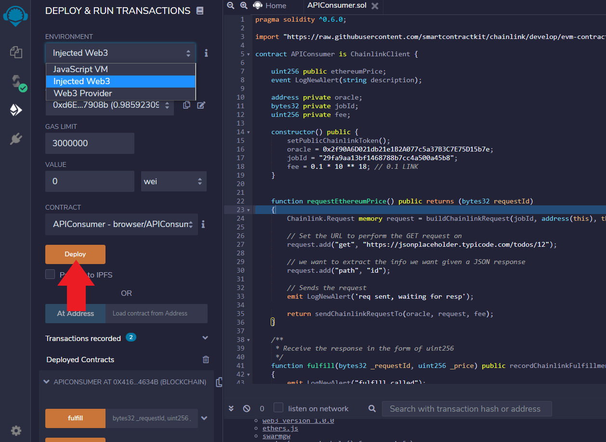

# Introduction to Oracles

- [What are Oracles](#what-are-oracles)
- [Why do they exist](#why-do-they-exist)
- [Main Challenges](#main-challenges)
- [Current Oracle Solutions](#current-oracle-solutions)
- [Example: contract w oracles](#example-contract-using-oracles)
- [MetaMask deploy using injected Web3 on Kovan Test Network](#metaMask-deploy-using-injected-Web3-on-kovan-test-network)

## What are Oracles

- A connection between a blockchain (on-chain) and the external off-chain world; oracles can interact with external software as well as hardware
- An oracle is not a store of data, but is a layer on a separate network that queries and verifies external information before relaying it.
- Inbound: relays off-chain data from the external world to the blockchain or smart contract
  - Example: An IOT thermometer monitors heat inside a meat-delivery truck. A safe temperature range is agreed on in advance in the smart contact. The smart contract will automatically execute payment to the delivery service as long as the truck temperature stays within the range for the trip.
  - An inbound oracle communicates directly with the thermometer and the smart contract--only signing the smart contract for approved payment if the thermometer stays in the prespecified range.
- Outbound: relays on-chain data/events from a blockchain or smart contract to the external world
  - Example: After a hotel room’s address receives your payment, a smart contract communicates with an outbound oracle to unlock the door and turn on the electricity in your room.

## Why do they exist

- Oracles are our connection between the digital world and the physical world.
- Without oracles, smart contracts have much more limited application, especially in interfacing between our current web 2.0 world and the new web 3.0 world.
- Oracles are a large part of the “real-time” data benefit of blockchain applications
- If solved, this becomes a key part of the scalability solution… what can be offchain should be completed offchain, however we cannot do as much of that currently since we cannot guarantee “trust-worthiness” of the results

## Main Challenges

- We should be able to trust data from oracles but that requires we trust oracles, but can we actually? This is a question that is often asked.
- Due to the complexity of operations need to verify or get multiple results for additional validity it’s frequently quite costly to use a oracle in production
- Increased risks of centralization and attack surface (Blockchain <> Oracles <> Other APIs)

## Current Oracle Solutions

Multiple blockchain teams are actively working on possible Oracle solutions:

- [Provable](https://provable.xyz/)
- [Chainlink](https://chain.link/)
- [Cosmos + band protocol](https://bandprotocol.com/)
- [Microsoft Coco](https://azure.microsoft.com/blog/announcing-microsoft-s-coco-framework-for-enterprise-blockchain-networks/)

This technology is considered the cutting edge of the blockchain, while ChainLink is considered the current front runner and the most mature, it is still not super developer or user friendly. For example it’s very hard to debug why a certain Oracle transaction failed, but like most things in blockchain, we’ll get there :)  

## Example contract using Oracles

```solidity
pragma solidity ^0.6.0;

import "https://raw.githubusercontent.com/smartcontractkit/chainlink/develop/evm-contracts/src/v0.6/ChainlinkClient.sol";

contract APIConsumer is ChainlinkClient {

    uint256 public ethereumPrice;
    event LogNewAlert(string description);

    address private oracle;
    bytes32 private jobId;
    uint256 private fee;

    constructor() public {
        setPublicChainlinkToken();
        oracle = 0x2f90A6D021db21e1B2A077c5a37B3C7E75D15b7e;
        jobId = "29fa9aa13bf1468788b7cc4a500a45b8";
        fee = 0.1 - 10 ** 18; // 0.1 LINK
    }


    function requestEthereumPrice() public returns (bytes32 requestId)
    {
        Chainlink.Request memory request = buildChainlinkRequest(jobId, address(this), this.fulfill.selector);

        // Set the URL to perform the GET request on
        // this is just a placeholder API for the purpose of demo
        request.add("get", "https://jsonplaceholder.typicode.com/todos/12");

        // we want to extract the info we want given a JSON response
        request.add("path", "id");

        // Sends the request
        emit LogNewAlert('req sent, waiting for resp');

        return sendChainlinkRequestTo(oracle, request, fee);
    }

    /**
     - Receive the response in the form of uint256
     */
    function fulfill(bytes32 _requestId, uint256 _price) public recordChainlinkFulfillment(_requestId)
    {
        emit LogNewAlert("fulflll called");
        ethereumPrice = _price;
    }
}

```

## MetaMask deploy using injected Web3 on Kovan Test Network

- Copy the `APIConsumer` contract to [Remix](https://remix.ethereum.org/).
- Compile the code


- Choose **Injected Web3** as an Environment and click **Deploy**


- Your contract should now be deployed with MetaMask!
- Get the testnet address


- Go to https://kovan.chain.link/ and paste your testnet address in the field


- Go to MetaMask and click **Add Token**


- Click Custom Token and paste the contract address, then click next.
  - Token Contract Address:`0xa36085F69e2889c224210F603D836748e7dC0088`
  - Token symbol: `LINK`
  - Decimals of precision: `18`


- Click **Add Tokens**


- You will see 100 LINK. Click **SEND**


- Add your deployed contract address to the field and choose amount of 10 LINK


- Confirm and then wait until status is not pending.
- Focus your attention back to Remix. Click **ethereumPrice** which should be 0. Now click **requestEthereumPrice** and Confirm in MetaMask.


- Afterwards click **ethereumPrice**, it should now be 12!

## Summary
- We were able to securely use a oracle and get off chain data to a smart contract
- This example demonstrates how to use oracles with a generic REST API 
