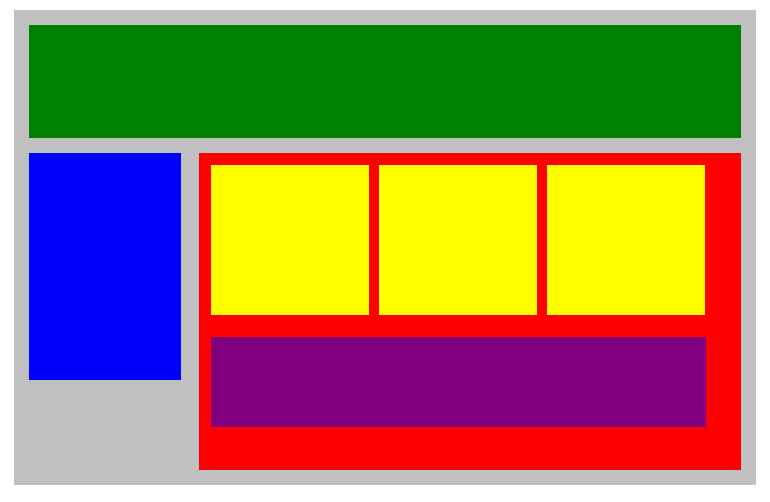

# Activity: Plotting Your Blocks

Duplicate this image by adjusting the CSS code below. Use **margins** and **paddings** to adjust the spaces between divisions and use the **display** property to put each block in its proper place. You may also need to add CSS properties.



## The HTML code

``` html
<!DOCTYPE html>
<html lang="en">
   <head>
      <title>Position Practice</title>
      <link rel="stylesheet" type="text/css" href="style.css">
   </head>
   <body>
       <div id="wrapper">
         <div id="header"></div>
         <div id="navigation"></div>
         <div id="main_content">
            <div class="subcontents"></div>
            <div class="subcontents"></div>
            <div class="subcontents"></div>
            <div id="advertisement"></div>
         </div>
      </div><!-- end of wrapper -->
   </body>
</html>
```

## The CSS code

``` css
/*CSS reset settings here*/
*{
 margin: 0px;
 padding: 0px;
}
#wrapper{
 width: 950px;
 background-color: silver;
 margin: 0px auto;
}
#header{
 min-height: 150px;
 background-color: green;
}
#navigation{
 min-height: 300px;
 width: 200px;
 background-color: blue;
}
#main_content{
 min-height: 400px;
 width: 700px;
 background-color: red;
}
.subcontents{
 min-height: 200px;
 width: 210px;
 background-color: yellow;
}
#advertisement{
 min-height: 120px;
 width: 660px;
 background-color: purple;
}
```

While you complete this activity, please use min-height to give minimum height to the division. Also, use vertical align to vertically align some of the inline-blocks. Lastly, please do NOT use float; instead, use display:inline-block.

[You can also complete the activity online at Codepen](https://codepen.io/dannyooooo/pen/100311ce217467fbcf13862a5090012b)

## What you learned

This activity taught you how to correctly use margins, padding, borders, and the display property to design your web pages. This is an essential activity of the workshop. If you don’t get this the first time, don’t be discouraged, keep working at it. You can keep using the pot in your box template to create the base for other static HTML pages. Now it is time to create our capstone project and deploy it on Azure.

 NEXT: [Part 4. Capstone Project and Deployment with Azure](../4_Capstone_Deployment)
