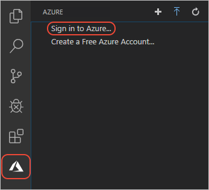
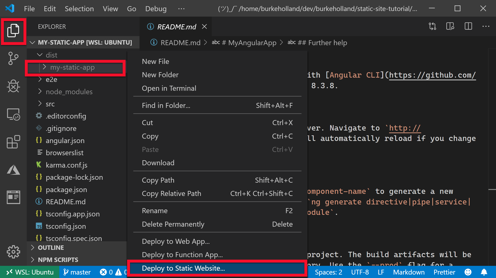

# Pubish/Deploy Your Files to Azure Storage 

In web development, "deployment" means to put the content you have created online. When you deploy, you are publishing your website to the web. There are many ways to publish your content online. Today, we will use Azure Storage with the help of Visual Studio Code.

A static website is composed of HTML, CSS, JavaScript, and other static files, such as images or fonts. Hosting in Azure Storage is simpler and less expensive than maintaining a web server.

## Prerequisites

* An [Azure subscription](https://azure.microsoft.com/)
* [Visual Studio Code](https://code.visualstudio.com/)
* The [Azure Storage extension](https://marketplace.visualstudio.com/items?itemName=ms-azuretools.vscode-azurestorage)

## Azure subscription

If you don't have an Azure subscription, [sign up now for a free account](https://azure.microsoft.com/en-us/free/) which includes $200 in Azure credits to use on any combination of services.

## Sign in to Azure

1. Once you've installed the Azure extension, sign into your Azure account: Go to your Azure Storage explorer, select **Sign in to Azure**, and follow the prompts. (If you have multiple Azure extensions installed, select the one for the area in which you're working, such as App Service, Functions, etc.)

2. After signing in, verify that the email address of your Azure account (or that **Signed In**) appears in the status bar and your subscription(s) appears in the Azure explorer:

Now you have a location where you can publish your online work.

## Publish/Deploy your files

1. In Azure, navigate to the folder you want to publish with the command line and type `code .` while you are in that directory.

2. Open Visual Studio Code, and then select the Azure logo in the lefthand pane to open the Azure Storage Explorer. 

3. In the menu that opens, click on **Storage** to expand the menu.

4. Right-click the name of your Azure subscription, and then select **Create Storage Account**.

5. When **Enter the name of the new storage account** appears, type a globally-unique name for your storage account and then select **Enter**. 
Valid characters for a name are 'a-z' and '0-9'.

6. When **Select a resource group** appears, select **Create a new Resource Group**. Accept the default name.

7. When **Select a location** appears, choose the region nearest your location.

* While the storage account is being created, a progress bar appears in the Output panel of Visual Studio Code.

8. When the storage account creation is complete, right-click the storage account and select **Configure Static Website**. 
Azure Storage will automatically serve your index document and any other static assets.

9. When prompted, type **index.html** for both the index document name and the 404 error document name. Use index.html for your error page unless you have created a custom 404 page.

10. Select the files explorer icon in the left pane, and then right-click the folder that contains your web files. 

11. Select **Deploy to Static Website**.

12. When prompted, select the storage account that you previously created.

13. When deployment is complete, a message will appear with a **Browse to website** button. Click the button to open the primary endpoint of the deployed app code.

14. Navigate to the web address that the extension creates. You have published your website!

Congratulations! You have completed the workshop.

## Course modules

* [Part 1. Web Basics](../Part%201.%20Web%20Basics)
* [Part 2. HTML: Hypertext Markup Language](../Part%202.%20HTML)
* [Part 3. CSS: Selectors, Styling, and Display](../Part%203.%20CSS%20%26%20CSS3)
* [Part 4. Capstone Project and Deployment with Azure](../Part%204.%20%20Capstone%20%2B%20Deployment)
