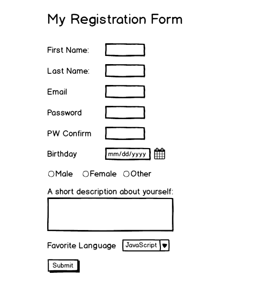

# Activity: Registration Form

Now that you've learned about the different types of form tags, you are ready to create a registration form using only HTML. When registering for any website, whether it's for an email account, a social media platform, or even this workshop, you are submitting a form! Over the next few months, you will use many forms to send data to your back end, so let's get comfortable creating forms.



Recreate the HTML elements shown on the image above! As you haven't yet learned how to use CSS to make the form look nice, don't worry about that for now.

Your HTML should contain the following tags:

* ```<input>``` with these values in the "type" attribute:
  * text
  * password
  * date
  * radio
  * submit
* ```<textarea>```
* ```<select>```

Don't feel the need to memorize the different form tags and attributes today; there are simply too many to memorize. Instead, bookmark a site where you can find the reference information for HTML tags. A great example is [W3Schools](https://www.w3schools.com/default.asp), a trusted online reference for web development.

> **NOTE:** Remember to validate your code before submitting it. HTML validation services, such as the free [W3C Markup Validation Service](https://validator.w3.org/), are useful debuggers that help you identify rendering errors.

Need a place to work on this? You can perform this activity in this [HTML environment](https://codepen.io/dannyooooo/pen/GRgdYME).

When you've completed this assignment, [check out these important tips](./tips_for_html.md)!

NEXT: [Part 2. CSS: Selectors, Styling, and Display](Part%202.%20CSS%20%26%20CSS3)
