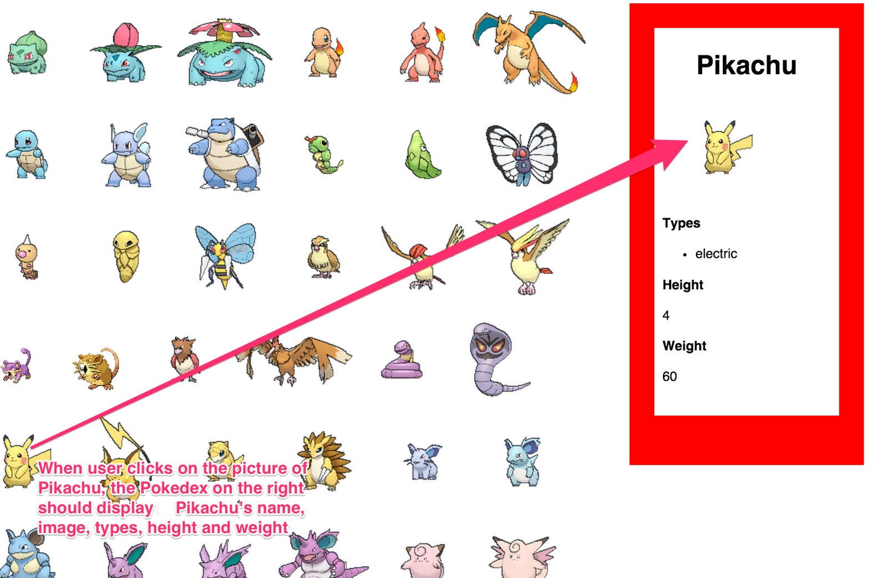

# Capstone Project: Create a Pokedex Page

## Part 1

Instructions: Using the PokeAPI, create a page that shows the first 151 Pokemon sprite images. You can build 151 images by hand or you can use a `for` loop in JavaScript and your jQuery knowledge to produce the image tags in the body of your HTML.  If the images load slowly, consider reducing to 15 images.

``` html
    <!-- add http:// before the website name -->
    
    
    
    
```

Note: These images are hotlinked and may not work. Use the API v2 to find a sprite image that you can use to display the Pokemon.

## Part 2

Instructions: Add a click function that will show the side panel to each Pokemon you rendered in Part 1.



How do you know which Pokemon was clicked? Perhaps by giving each Pokemon a unique ID that corresponds with their number in the URL?

``` html

<!-- add http:// before the website name -->
```

So that when the image is clicked, we get its id and add it to the end of this URL: `http://pokeapi.co/api/v2/pokemon/` then we make the ajax request with that URL that we constructed.

Work at a solution--both alone and with others--for at least 30 minutes. If you can't find a solution, try implementing the code in your browser. Retype it instead of cutting and pasting to become familiar with every line. [Here is a working example](https://codepen.io/dannyooooo/pen/229e50320ec54d6b8e2f845fa07672ba).

NEXT: [Deploy Your Pokedex to the Web](./deploy.md)
